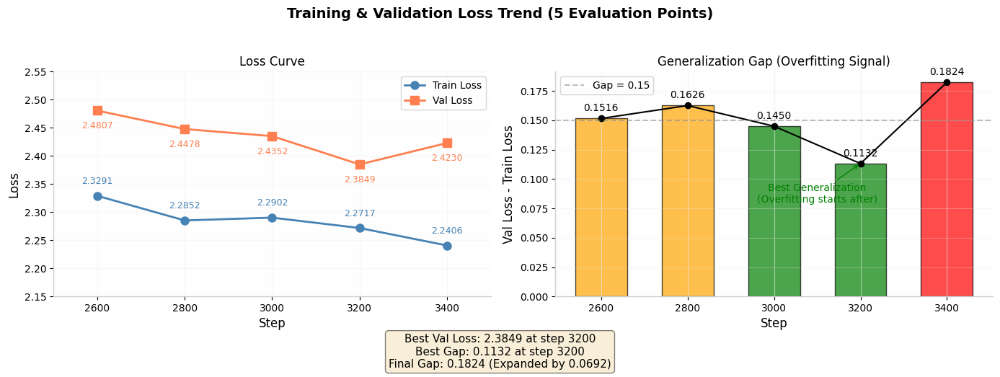

# GPT Code Pre-Training
A GPT language model implemented from scratch in PyTorch, pre-trained on multi-language code data.

## Model Architecture

Implemented from scratch, Model configuration:

| Parameter    | Value  |
|--------------|--------|
| n_layer      | 16     |
| n_head       | 16     |
| n_embd       | 1024    |
| block_size   | 1024   |
| vocab_size   | 64000  |

**Key features:**
- FlashAttention support (with fallback to standard attention)
- Weight tying between token embeddings and language model head
- 8-bit AdamW optimizer support (via bitsandbytes)
- Multi-GPU distributed training (DDP)

## Model szie
model size: 270M
memry_size : 1.07GB (float32)
computational method:
total_num = sum(p.numel() for p in self.parameters())
dtype = next(self.parameters()).dtype
dtype_size = torch.finfo(dtype).bits // 8 if dtype.is_floating_point else 1
memery_size = total_num * dtype_size /1e9
## Setup

```bash
pip install torch numpy tiktoken
```

For 8-bit optimizer:
```bash
pip install bitsandbytes
```

For data preprocessing (optional):
```bash
pip install modelscope datasets tqdm
```

## Data Preprocessing

```bash
python data/stack-v2-train-smol.py
```

This downloads code data from HuggingFace starcoderdata, tokenizes it with 01-ai/Yi-6B tiktoken encoder, and saves binary `.bin` files.

**Supported languages and ratios:**
    "python": 0.25,
    "c": 0.2,
    "javascript": 0.15,
    "go": 0.20,
    "c++": 0.20,

## pre-Training
```bash
python train.py
```

**Key hyperparameters (in `train.py`):**
- Max learning rate: `6e-4` (cosine decay to `6e-5`)
- Warmup steps: 600
- Max steps: 6000
- Batch size: 32
- Block size: 1024
- Weight decay: 0.1
- Gradient clip: 1.0
- drop: 0.0
- Mixed precision: bfloat16 (or float16 if bf16 unsupported)
- Square Root Scaling Rule

**Features:**
- Gradient accumulation (total batch ~524k tokens)
- Automatic checkpoint saving (best val loss)
- Resume training from checkpoint
- MFU (Model FLOPs Utilization) monitoring
- Wandb logging (set `wandb_log = True`)


**Pre-Training Data:**
code data

```bash
python data/stack-v2-train-smol.py
```

en data
dataset:fineweb-CC-MAIN-2024-10-1B-en
first:download local
```bash
python data/fineweb.py
```

cn data
dataset: wikipedia-zh-cn-20260201

first:download local

second:
```bash
python data/wiki.py
```

**Pre-Training Result:**


Evaluation Schedule: Starting from step 2600, train/val loss evaluated every 200 steps.
Steps 2600–2800: Both losses decreased with gap < 0.2 → continued training.
At Step 3000:
train: 2.2794 | val: 2.4493 | gap: 0.170
Val loss plateaued while train loss slightly decreased → early sign of overfitting.
→ Applied regularization: dropped 10% neurons (Dropout) and adjusted hyperparameters.
Post-adjustment: Train loss stabilized (expected), val loss resumed decreasing → generalization improved.
Steps 3000–3200: Both losses declined steadily; gap reduced to 0.113 → strong learning signal.
Steps 3200–3400: Train loss decreased but val loss increased → clear overfitting (likely due to limited model capacity vs. large dataset).
→ Training stopped at step 3200; checkpoint with best generalization retained.

## Inference / Sampling
```bash
python sample.py
```

Generates text from the trained model checkpoint (`out/base.pt`).

**Parameters (in `sample.py`):**
- `temperature`: 0.9 (controls randomness)
- `top_k`: 200 (limits vocabulary)
- `max_new_tokens`: 500
- `num_samples`: 10

**Example output:**
#include <memory>

using namespace std;
template<class T>
void Copy<T>::operator new(T&& other) {
        other.s = m_s;
        other.a = 1.0;
        other.b = 1.0;
        other.c = 0.03;
        for(int i = 0; i < m_s; i++)
        {
                m_s[i] = other[i];
                m_s[i] = m_s[i];
        }
}

template<class T>
void Copy<T>::operator new(const T& other) {
        other.s = m_s;
        other.a = 0.03;
        other.b = 1.0;
        for(int i = 0; i < m_s; i++)
        {
                if(other[i] == other[i])
                        other[i] = m_s[i];
        }
}

template<class T>
void Copy<T>::operator new(int vector[4]) {
        vector[0] = vector[0] * sizeof(T);
        copy(vector[1], vector[2]);
        copy(vector[2], vector[3]);
        copy(vector[3], vector[4]);
        copy(vector[4], vector[5]);
        copy(vector[5], vector[6]);
        copy(vector[6], vector[7]);
        copy(vector[7], vector[8]);
        copy(vector[8], vector[9]);
        copy(vector[9], vector[10] * sizeof(T) * sizeof(T));
}

template<class T>
void Copy<T>::operator new(int vector[], int vector2[4]) {
        transers.map((T*)vector, (size_t)vector2);
}

# #### data of size
# def data():
#     s = 96
#     for i, text in enumerate(data.split(';'), 96):
#         all_words_in_words[i] = total_sum(text)

    return all_words_in_words


def extract_features(features_dict):
    """
    extract features and extract mean and use them for all words
    """
    labels = labels.split(';')
    # extract mean and use them for all words
    features = []
    for text in features:
        l = len(text)
        mean = 0
        counts = max(counts, 0)
        # extract counts and use them for all words
        counts += l * counts + mean
        labels.append(l)
        labels.append(lx.Label())

    labels = labels.split(',')
    # extract mean and use them for all words
    labels = labels.split(';')
    if len(labels) == 1:
        labels = labels.split(',')

    features = []
    for text in labels:
        l = len(text)
        mean = 0
        counts = max(counts, 0)
        labels.append(l)
        labels.append(lx.Label())
        labels.append(l)
        labels.append(lx.Label())

    _, _, _ = s.get_num_words()
    words = torch.maximum(100, words.max(100), dim=-1).unsqueeze(0).expand(0)
    features = torch.cat(features, l)
    labels = torch.cat(labels, dim=-1).
## License

MIT License
